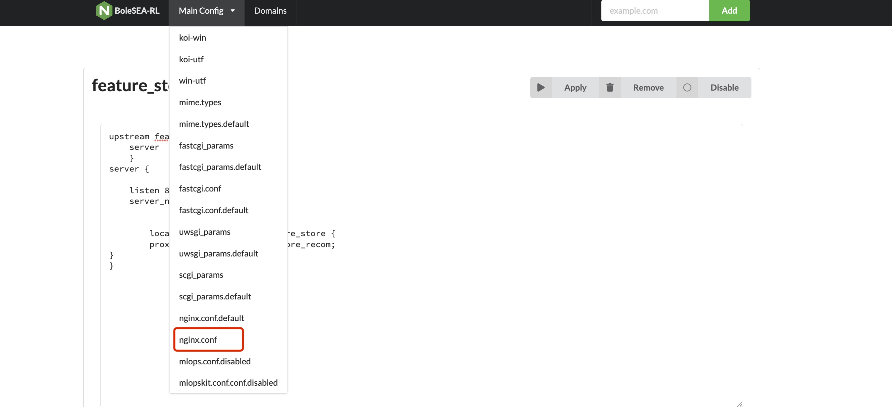

# RLLoadBalancer
modify the nginx configurations files without cli.


## 简介
模型的服务配置在主页进行
执行顺序：
- step1:

```python
upstream featurestore_recom{
    server  0.0.0.0:5009;
    }
server {

    listen 8905 default_server;
    server_name _;
 

	location /recomserver/feature_store {
        proxy_pass http://featurestore_recom;
}
}
```
- step2:
打开main-config的nginx.conf，进行Test和Apply，模型服务生效
